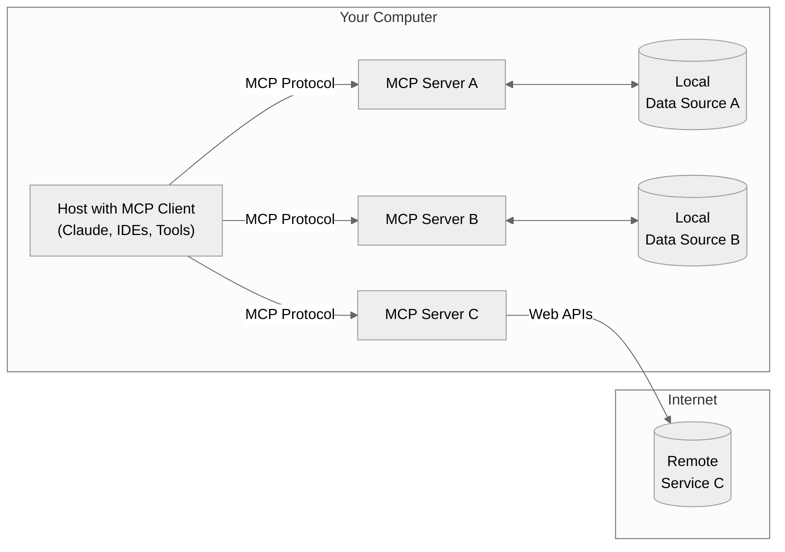
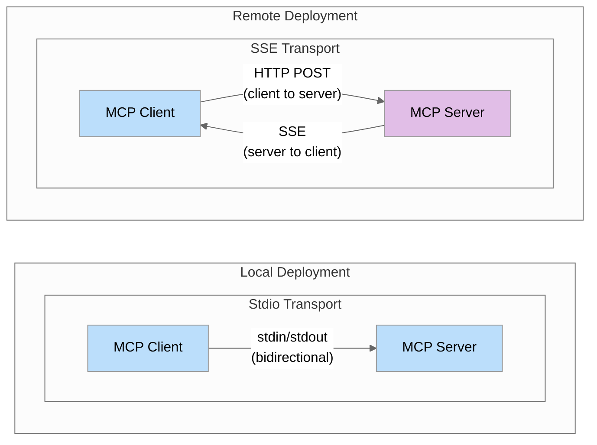

## MCP - Model Context Protocol


*'Estamos disponibilizando o Model Context Protocol (MCP), um novo padrão para conectar assistentes de IA aos sistemas onde os dados residem.'*   
 Anthropic: https://www.anthropic.com/news/model-context-protocol.


<p align="center">
  
  <br>
  <em>What is MCP? - https://www.descope.com/learn/post/mcp</em>
</p>

- Protocolo. Forma padronizada de disponibilizar ferramentas e recursos para LLMs.
- Servidores MCP: https://github.com/modelcontextprotocol/servers
- OpenAI: https://openai.github.io/openai-agents-python/mcp/
- 'Why MCP won?' - https://www.latent.space/p/why-mcp-won


## Python SDK

https://github.com/modelcontextprotocol/python-sdk


## Understanding MCP at a Technical Level

### MCP Architecture Overview

The Model Context Protocol follows a client-host-server architecture:
This separation of concerns allows for modular, composable systems where each server can focus on a specific domain (like file access, web search, or database operations).

- **MCP Hosts**: Programs like Claude Desktop, IDEs, or your python application that want to access data through MCP
- **MCP Clients**: Protocol clients that maintain 1:1 connections with servers
- **MCP Servers**: Lightweight programs that each expose specific capabilities through the standardized Model Context Protocol (tools, resources, prompts)
- **Local Data Sources**: Your computer’s files, databases, and services that MCP servers can securely access
- **Remote Services**: External systems available over the internet (e.g., through APIs) that MCP servers can connect to

This separation of concerns allows for modular, composable systems where each server can focus on a specific domain (like file access, web search, or database operations).



MCP defines three core primitives that servers can implement:

1. [Tools](https://modelcontextprotocol.io/docs/concepts/tools#python): Model-controlled functions that LLMs can invoke (like API calls, computations)
2. [Resources](https://modelcontextprotocol.io/docs/concepts/resources#python): Application-controlled data that provides context (like file contents, database records)
3. [Prompts](https://modelcontextprotocol.io/docs/concepts/prompts#python): User-controlled templates for LLM interactions

For Python developers, the most immediately useful primitive is tools, which allow LLMs to perform actions programmatically.

### Transport Mechanisms Deep Dive

MCP supports two main transport mechanisms:

1. **Stdio (Standard IO)**: 
   - Communication occurs over standard input/output streams
   - Best for local integrations when the server and client are on the same machine
   - Simple setup with no network configuration required

2. **SSE (Server-Sent Events)**:
   - Uses HTTP for client-to-server communication and SSE for server-to-client
   - Suitable for remote connections across networks
   - Allows for distributed architectures

Understanding when to use each transport is crucial for building effective MCP implementations:

- Use **Stdio** when building single-application integrations or during development
- Use **SSE** when you need remote accessibility or are integrating with clients that require it

#### Transport Mechanism Comparison



If you're familiar with FastAPI, you'll find that implementing an MCP server with SSE transport feels very similar. Both frameworks use HTTP endpoints for receiving requests and support streaming responses using Server-Sent Events. They both allow you to define handlers for specific routes/endpoints and provide async/await patterns for handling requests and generating responses. This similarity makes it easy for FastAPI developers to transition to building MCP servers, as they can leverage their existing knowledge of HTTP, async programming, and streaming responses.

### A New Standard

The true power of MCP isn't in introducing new capabilities, but in standardizing how these capabilities are exposed and consumed. This provides several key advantages:

- **Reusability**: Build a server once, use it with any MCP-compatible client
- **Composability**: Combine multiple servers to create complex capabilities
- **Ecosystem growth**: Benefit from servers created by others

The MCP ecosystem is already growing rapidly, with servers available many tools. You can find an overview here: [Officially supported servers](https://github.com/modelcontextprotocol/servers)

This means you can leverage existing servers rather than reinventing the wheel, and contribute your own servers to benefit the community.


## Simple Server Setup with Python SDK

### Building Your First MCP Server

Let's create a simple demo server with a tool:

```python
# server.py
from mcp.server.fastmcp import FastMCP

# Create an MCP server
mcp = FastMCP("DemoServer")

# Simple tool
@mcp.tool()
def say_hello(name: str) -> str:
    """Say hello to someone

    Args:
        name: The person's name to greet
    """
    return f"Hello, {name}! Nice to meet you."

# Run the server
if __name__ == "__main__":
    mcp.run()
```

### Running the Server

There are several ways to run your MCP server:

#### 1. Development Mode with MCP Inspector

The easiest way to test your server is using the MCP Inspector:

```bash
mcp dev server.py
```

This runs your server locally and connects it to the MCP Inspector, a web-based tool that lets you interact with your server's tools and resources directly. This is great for testing.

#### 2. Claude Desktop Integration

If you have Claude Desktop installed, you can install your server to use with Claude:

```bash
mcp install server.py
```

This will add your server to Claude Desktop's configuration, making it available to Claude.

#### 3. Direct Execution (only needed or SSE)

You can also run the server directly:

```bash
# Method 1: Running as a Python script
python server.py

# Method 2: Using UV (recommended)
uv run server.py
```

### What Happens When You Run an MCP Server?

When you run an MCP server:

1. The server initializes with the capabilities you've defined (tools, resources, etc.)
2. It starts listening for connections on a specific transport

By default, MCP servers don't use a traditional web server port. Instead, they use either:

- **stdio transport**: The server communicates through standard input and output (the default for `mcp run` and integration with Claude Desktop)
- **SSE transport**: For HTTP-based communication (used when explicitly configured)

If you want to expose your server over HTTP with a specific port, you need to modify your server to use the SSE transport:

```python
from mcp.server.fastmcp import FastMCP

mcp = FastMCP("MyServer", host="127.0.0.1", port=8050)

# Add your tools and resources here...

if __name__ == "__main__":
    # Run with SSE transport on port 8000
    mcp.run(transport="sse")
```

Then you can run it with:

```bash
python server.py
```

This will start your server at `http://127.0.0.1:8050`.

### Client-Side Implementation (with Standard I/O)

Now, let's see how to create a client that uses our server:

```python
import asyncio
import nest_asyncio
from mcp import ClientSession, StdioServerParameters
from mcp.client.stdio import stdio_client

async def main():
    # Define server parameters
    server_params = StdioServerParameters(
        command="python",  # The command to run your server
        args=["server.py"],  # Arguments to the command
    )

    # Connect to the server
    async with stdio_client(server_params) as (read_stream, write_stream):
        async with ClientSession(read_stream, write_stream) as session:
            # Initialize the connection
            await session.initialize()

            # List available tools
            tools_result = await session.list_tools()
            print("Available tools:")
            for tool in tools_result.tools:
                print(f"  - {tool.name}: {tool.description}")

            # Call our calculator tool
            result = await session.call_tool("add", arguments={"a": 2, "b": 3})
            print(f"2 + 3 = {result.content[0].text}")


if __name__ == "__main__":
    asyncio.run(main())
```

This client:

1. Creates a connection to our server via stdio
2. Establishes an MCP session
3. Lists available tools
4. Calls the `add` tool with arguments

### Client-Side Implementation (with Server-Sent Events)

Here's how to connect to your server with SSE:

```python
import asyncio
import nest_asyncio
from mcp import ClientSession
from mcp.client.sse import sse_client

async def main():
    # Connect to the server using SSE
    async with sse_client("http://localhost:8050/sse") as (read_stream, write_stream):
        async with ClientSession(read_stream, write_stream) as session:
            # Initialize the connection
            await session.initialize()

            # List available tools
            tools_result = await session.list_tools()
            print("Available tools:")
            for tool in tools_result.tools:
                print(f"  - {tool.name}: {tool.description}")

            # Call our calculator tool
            result = await session.call_tool("add", arguments={"a": 2, "b": 3})
            print(f"2 + 3 = {result.content[0].text}")


if __name__ == "__main__":
    asyncio.run(main())
```

### Which Approach Should You Choose?

- **Use stdio** if your client and server will be running in the same process or if you're starting the server process directly from your client.
- **Use HTTP** if your server will be running separately from your client, possibly on different machines or in different containers.

For most production backend integrations, the HTTP approach offers better separation and scalability, while the stdio approach might be simpler for development or tightly coupled systems.


## OpenAI Integration with MCP

This section demonstrates how to integrate the Model Context Protocol (MCP) with OpenAI's API to create a system where OpenAI can access and use tools provided by your MCP server.

### Overview

This example shows how to:

1. Create an MCP server that exposes a knowledge base tool
2. Connect OpenAI to this MCP server
3. Allow OpenAI to dynamically use the tools when responding to user queries

### Connection Methods

This example uses the **stdio transport** for communication between the client and server, which means:

- The client and server run in the same process
- The client directly launches the server as a subprocess
- No separate server process is needed

If you want to split your client and server into separate applications (e.g., running the server on a different machine), you'll need to use the **SSE (Server-Sent Events) transport** instead. For details on setting up an SSE connection, see the [Simple Server Setup](../3-simple-server-setup) section.

### Data Flow Explanation

1. **User Query**: The user sends a query to the system (e.g., "What is our company's vacation policy?")
2. **OpenAI API**: OpenAI receives the query and available tools from the MCP server
3. **Tool Selection**: OpenAI decides which tools to use based on the query
4. **MCP Client**: The client receives OpenAI's tool call request and forwards it to the MCP server
5. **MCP Server**: The server executes the requested tool (e.g., retrieving knowledge base data)
6. **Response Flow**: The tool result flows back through the MCP client to OpenAI
7. **Final Response**: OpenAI generates a final response incorporating the tool data

### How OpenAI Executes Tools

OpenAI's function calling mechanism works with MCP tools through these steps:

1. **Tool Registration**: The MCP client converts MCP tools to OpenAI's function format
2. **Tool Choice**: OpenAI decides which tools to use based on the user query
3. **Tool Execution**: The MCP client executes the selected tools and returns results
4. **Context Integration**: OpenAI incorporates the tool results into its response

### The Role of MCP

MCP serves as a standardized bridge between AI models and your backend systems:

- **Standardization**: MCP provides a consistent interface for AI models to interact with tools
- **Abstraction**: MCP abstracts away the complexity of your backend systems
- **Security**: MCP allows you to control exactly what tools and data are exposed to AI models
- **Flexibility**: You can change your backend implementation without changing the AI integration

### Implementation Details

#### Server (`server.py`)

The MCP server exposes a `get_knowledge_base` tool that retrieves Q&A pairs from a JSON file.

#### Client (`client.py`)

The client:

1. Connects to the MCP server
2. Converts MCP tools to OpenAI's function format
3. Handles the communication between OpenAI and the MCP server
4. Processes tool results and generates final responses

#### Knowledge Base (`data/kb.json`)

Contains Q&A pairs about company policies that can be queried through the MCP server.

### Running the Example

1. Ensure you have the required dependencies installed
2. Set up your OpenAI API key in the `.env` file
3. Run the client: `python client.py`

Note: With the stdio transport used in this example, you don't need to run the server separately as the client will automatically start it.


## Comparing MCP to Traditional Approaches

### Side-by-Side Comparison

Let's compare our MCP implementation to a traditional function-calling approach in `function-calling.py`

At this small scale, the traditional approach is simpler. The key differences become apparent when:

1. **Scale increases**: With dozens of tools, the MCP approach provides better organization
2. **Reuse matters**: The MCP server can be used by multiple clients and applications
3. **Distribution is needed**: MCP provides standard mechanisms for remote operation

### When to Use MCP vs. Traditional Approaches

**Consider MCP when**:

- You need to share tool implementations across multiple applications
- You're building a distributed system with components on different machines
- You want to leverage existing MCP servers from the ecosystem
- You're building a product where standardization provides user benefits

**Traditional approaches may be better when**:

- You have a simpler, self-contained application
- Performance is critical (direct function calls have less overhead)
- You're early in development and rapid iteration is more important than standardization


## MCP Server with Docker

This project demonstrates how to run an MCP (Model Control Protocol) server using Docker. The server provides a simple calculator tool that can be accessed by a client.

### Prerequisites

- Docker installed on your system
- Git (to clone the repository)

### Project Structure

- `server.py`: The MCP server implementation with a simple calculator tool
- `client.py`: A client that connects to the server and calls the calculator tool
- `Dockerfile`: Instructions for building the Docker image
- `requirements.txt`: Python dependencies for the project

### Running with Docker

#### Step 1: Build the Docker image

```bash
docker build -t mcp-server .
```

#### Step 2: Run the Docker container

```bash
docker run -p 8050:8050 mcp-server
```

This will start the MCP server inside a Docker container and expose it on port 8050.

### Running the Client

Once the server is running, you can run the client in a separate terminal:

```bash
python client.py
```

The client will connect to the server, list available tools, and call the calculator tool to add 2 and 3.

### Troubleshooting

If you encounter connection issues:

1. **Check if the server is running**: Make sure the Docker container is running with `docker ps`.

2. **Verify port mapping**: Ensure the port is correctly mapped with `docker ps` or by checking the output of the `docker run` command.

3. **Check server logs**: View the server logs with `docker logs <container_id>` to see if there are any errors.

4. **Host binding**: The server is configured to bind to `0.0.0.0` instead of `127.0.0.1` to make it accessible from outside the container. If you're still having issues, you might need to check your firewall settings.

5. **Network issues**: If you're running Docker on a remote machine, make sure the port is accessible from your client machine.

### Notes

- The server is configured to use SSE (Server-Sent Events) transport and listens on port 8050.
- The client connects to the server at `http://localhost:8050/sse`.
- Make sure the server is running before starting the client. 


## Lifecycle Management in MCP

Lifecycle management is a crucial aspect of the Model Context Protocol (MCP) that helps you control the initialization, operation, and termination of MCP servers and clients. Understanding lifecycle management is essential for building robust MCP applications.

### What is Lifecycle Management?

Lifecycle management in MCP refers to the process of properly initializing, maintaining, and terminating connections between MCP clients and servers. It ensures that resources are properly allocated and released, and that communication channels are established and closed correctly.

### Key Components of Lifecycle Management

#### 1. Initialization

Initialization is the first step in the MCP lifecycle:

- **Client Initialization**: The client establishes a connection to the server and negotiates protocol versions
- **Server Initialization**: The server validates the client's request and prepares to handle tool calls
- **Version Negotiation**: Both parties agree on a compatible protocol version to use for the session

```python
# Client initialization example
async with stdio_client(server_params) as (read, write):
    async with ClientSession(read, write) as session:
        # Initialize the connection
        await session.initialize()
```

#### 2. Operation

During the operation phase:

- **Tool Registration**: The server exposes its tools to the client
- **Tool Discovery**: The client discovers available tools from the server
- **Tool Execution**: The client calls tools and the server executes them
- **Resource Management**: The server manages resources needed for tool execution

```python
# Tool discovery example
tools_result = await session.list_tools()
print("Available tools:")
for tool in tools_result.tools:
    print(f"  - {tool.name}: {tool.description}")

# Tool execution example
result = await session.call_tool(
    tool_call.function.name,
    arguments=json.loads(tool_call.function.arguments),
)
```

#### 3. Termination

Termination ensures proper cleanup:

- **Resource Cleanup**: All resources allocated during the session are released
- **Connection Closure**: Communication channels are properly closed
- **State Reset**: Server state is reset for the next session

```python
# Termination happens automatically when exiting the context manager
async with ClientSession(read, write) as session:
    # Session operations
    # ...
# Session is automatically terminated here
```

### Advanced Lifecycle Management with the Lifespan Object

For more complex applications, MCP provides a feature called the **lifespan object** that helps manage application-level resources throughout the entire lifecycle of an MCP server.

#### What is the Lifespan Object?

The lifespan object is an asynchronous context manager that:

1. Initializes resources when the server starts
2. Makes those resources available to all tools during the server's operation
3. Properly cleans up resources when the server shuts down

#### How to Use the Lifespan Object

```python
from contextlib import asynccontextmanager
from collections.abc import AsyncIterator
from dataclasses import dataclass

from mcp.server.fastmcp import Context, FastMCP

# Define a type-safe context class
@dataclass
class AppContext:
    db: Database  # Replace with your actual resource type

# Create the lifespan context manager
@asynccontextmanager
async def app_lifespan(server: FastMCP) -> AsyncIterator[AppContext]:
    # Initialize resources on startup
    db = await Database.connect()
    try:
        # Make resources available during operation
        yield AppContext(db=db)
    finally:
        # Clean up resources on shutdown
        await db.disconnect()

# Create the MCP server with the lifespan
mcp = FastMCP("My App", lifespan=app_lifespan)

# Use the lifespan context in tools
@mcp.tool()
def query_db(ctx: Context) -> str:
    """Tool that uses initialized resources"""
    db = ctx.request_context.lifespan_context.db
    return db.query()
```

#### Benefits of Using the Lifespan Object

1. **Type Safety**: The lifespan context is strongly typed, providing better IDE support and error checking
2. **Resource Management**: Ensures resources are properly initialized and cleaned up
3. **Dependency Injection**: Provides a clean way to inject dependencies into tools
4. **Separation of Concerns**: Separates resource management from tool implementation

### Conclusion

By understanding and implementing the initialization, operation, and termination phases correctly, and leveraging the lifespan object for application-level resources, you can create more reliable, efficient, and secure MCP integrations.

For more detailed information on lifecycle management, refer to the [MCP Lifecycle](https://modelcontextprotocol.io/specification/2025-03-26/basic/lifecycle#lifecycle).