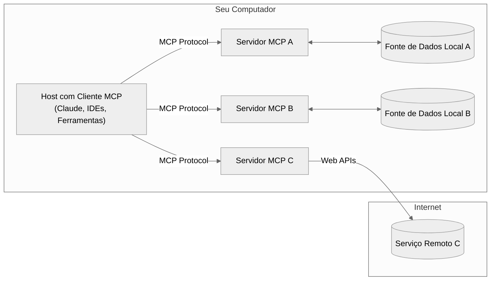
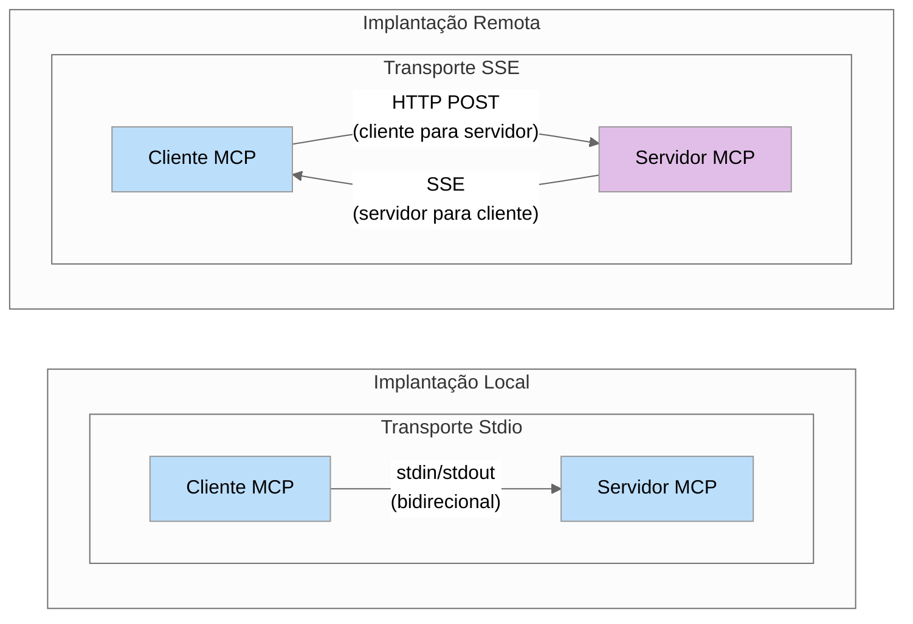

## MCP - Model Context Protocol

*'Estamos disponibilizando o Model Context Protocol (MCP), um novo padrão para conectar assistentes de IA aos sistemas onde os dados residem.'*   
 Anthropic: https://www.anthropic.com/news/model-context-protocol.

  
   
  <em>What is MCP? - https://www.descope.com/learn/post/mcp</em>

- Protocolo. Forma padronizada de disponibilizar ferramentas e recursos para LLMs.
- Servidores MCP: https://github.com/modelcontextprotocol/servers
- OpenAI: https://openai.github.io/openai-agents-python/mcp/
- 'Why MCP won?' - https://www.latent.space/p/why-mcp-won

--- 

### MCP: Hype e Realidade
O Model Context Protocol (MCP) vem gerando grande entusiasmo na comunidade de IA por padronizar a forma como LLMs interagem com ferramentas e serviços externos. Mas é importante entender que o MCP não é uma tecnologia radicalmente nova — e sim um novo padrão com potencial revolucionário.

A ideia central (dar acesso a ferramentas via chamadas de função) já é conhecida por quem trabalha com agentes baseados em LLMs. O diferencial do MCP é formalizar essa prática em um protocolo interoperável.

Embora muitos tutoriais foquem em casos de uso pessoal (como integrar o MCP a assistentes como Claude Desktop ou Cursor), há uma lacuna para desenvolvedores Python que precisam integrar o protocolo em sistemas de produção.

Este enfoque técnico inclui:
- Entender a arquitetura do MCP
- Criar servidores MCP personalizados usando o SDK Python
- Integrar esses servidores a aplicações Python
- Tomar decisões informadas sobre quando e como usar o MCP

---

### Visão Geral da Arquitetura MCP

O Model Context Protocol (MCP) segue uma arquitetura cliente-host-servidor, permitindo a criação de sistemas modulares e compostos, onde cada servidor pode se especializar em um domínio específico (como acesso a arquivos, busca na web ou operações em banco de dados).

**Hosts MCP**: Programas como Claude Desktop, IDEs ou sua aplicação Python que acessam dados via MCP.

**Clientes MCP**: Clientes do protocolo que mantêm conexões 1:1 com os servidores.

**Servidores MCP**: Programas leves que expõem capacidades específicas por meio do protocolo MCP (ferramentas, recursos, prompts).

**Fontes de Dados Locais**: Arquivos, bancos de dados e serviços do seu computador que os servidores MCP podem acessar com segurança.

**Serviços Remotos**: Sistemas externos acessíveis pela internet (ex.: via APIs) que os servidores MCP podem utilizar.

O MCP define três primitivas principais que os servidores podem implementar:

[Ferramentas]((https://modelcontextprotocol.io/docs/concepts/tools#python)): Funções controladas pelo modelo que LLMs podem invocar (como chamadas de API ou cálculos).

[Recursos](https://modelcontextprotocol.io/docs/concepts/resources#python): Dados controlados pela aplicação que fornecem contexto (como conteúdo de arquivos ou registros de banco de dados).

[Prompts](https://modelcontextprotocol.io/docs/concepts/prompts#python): Modelos de interação definidos pelo usuário.

Para desenvolvedores Python, a primitiva mais úcil de aplicar é ferramentas, pois permite que LLMs executem ações programáticas.

### Mecanismos de Transporte

O MCP suporta dois mecanismos principais de transporte:

**Stdio** (Entrada/Saída Padrão):

- A comunicação ocorre via streams padrão de entrada/saída

- Ideal para integrações locais quando cliente e servidor estão na mesma máquina

- Configuração simples, sem necessidade de rede

**SSE** (Server-Sent Events):

- Usa HTTP para requisições do cliente e SSE para respostas do servidor

- Apropriado para conexões remotas entre redes diferentes

- Permite arquiteturas distribuídas

Understanding when to use each transport is crucial for building effective MCP implementations:

- Use **Stdio** when building single-application integrations or during development
- Use **SSE** when you need remote accessibility or are integrating with clients that require it

Comparativo de Mecanismos de Transporte:

Se você já trabalha com FastAPI, vai notar semelhanças ao implementar um servidor MCP com transporte SSE: uso de endpoints HTTP, suporte a respostas em streaming e uso de async/await.

### Um Novo Padrão

O verdadeiro poder do MCP está na padronização, e não em funcionalidades novas. Isso oferece diversas vantagens:

Reutilização: Construa um servidor uma vez e use com qualquer cliente compatível com MCP.

Composição: Combine vários servidores para criar capacidades mais complexas.

Crescimento do ecossistema: Aproveite servidores já existentes e contribua com os seus.

O ecossistema MCP está crescendo rapidamente. Veja os servidores suportados aqui: Servidores oficiais.

Isso significa que você pode evitar retrabalho usando servidores prontos, ou contribuir para a comunidade desenvolvendo os seus.

---
### Python SDK

https://github.com/modelcontextprotocol/python-sdk